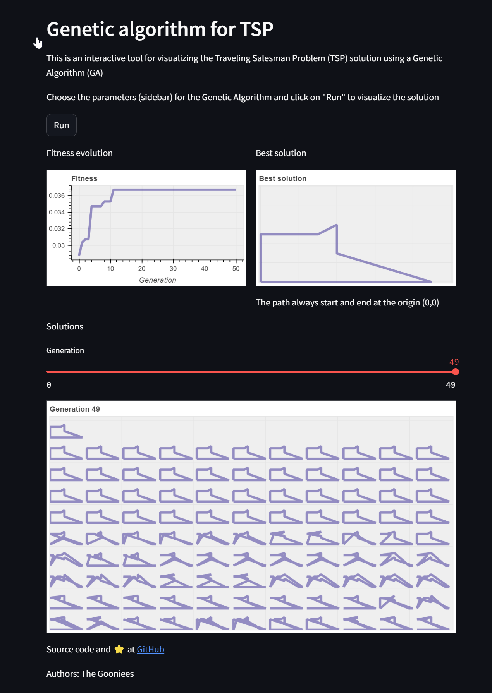

# Evolutionary Traveller (EvoTraveller)



## Description
This repository contains the Python code of a user-friendly visualization tool for solving simple examples of the Traveling Salesman Problem (TSP) using a Genetic Algorithm (GA). Ideal for students and educators interested in optimization and metaheuristics. This tool helps to understand the evolutionary strategy based on populations that allow find optimal solutions of complex combinatorial problems.
## Key Features
* Traveling Salesman Problem (TSP): is a classic optimization problem in which the goal is to find the shortest possible route that visits a set of given locations once and returns to the origin point [[Wikipedia](https://en.wikipedia.org/wiki/Travelling_salesman_problem)].
* Genetic Algorithm (GA): is type of metaheuristic inspired by the process of natural selection, which employs concepts like mutation, crossover, and selection to evolve a population of solution towards optimal or near-optimal solution of a problem [[Wikipedia](https://en.wikipedia.org/wiki/Genetic_algorithm)].
* Interactive visualization: users can visually track the evolution of the solution over generations, observing how the GA converges to an optimal or near-optimal route.
* Customizable parameters: users can adjust genetic algorithm parameters such as population size, generations, tournament size, mutation, the percentage of elitism and crossover, and explore the impact of these parameters on the algorithm's performance.

## Deploying on Streamlit Cloud
This repository is deployed in Streamlit Cloud and can be run at: https://evotraveller.streamlit.app/

## Local installation
1. Clone the repository from GitHub.
2. Install the required dependencies listed in [requirements.txt](https://github.com/jismartin/evotraveller/blob/main/requirements.txt).
3. Run the Streamlit app using the command:
```
streamlit run main.py
```

There is a Jupyter notebook with all the code that can be executed independently.

## License
This project is licensed under the [MIT License](https://github.com/jismartin/evotraveller/blob/main/LICENSE).
